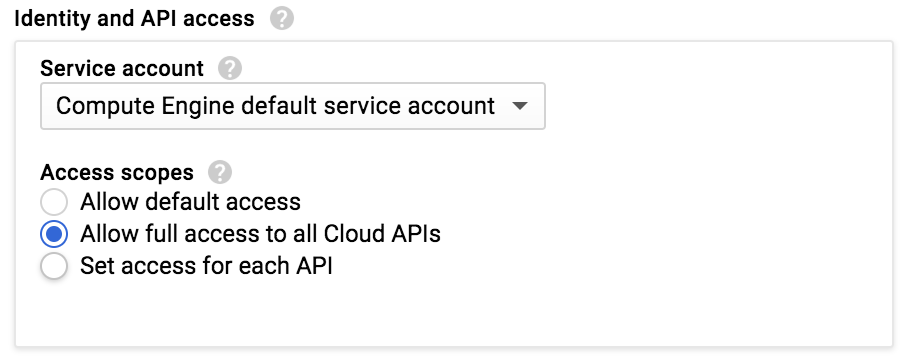
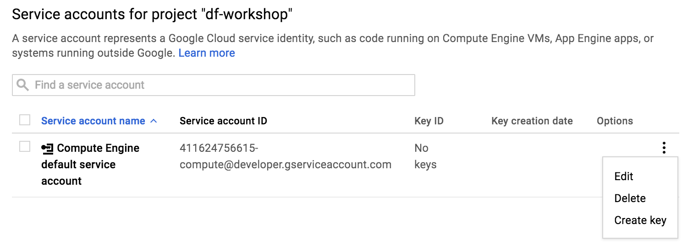

# Overview

This repo contains an example dataflow project that includes a batch pipeline, and a streaming pipeline.

# Pre-requisites

## Get a Google Cloud Platform Project

To try this, you'll need to have set up a Google Cloud Platform project. You can take advantage of the [GCP free trial](https://console.cloud.google.com/freetrial) if you like.

You can skip these steps if you're certain Pub/Sub is already ready to use in your project.

Next, run through the Pub/Sub [Quickstart: Using the Console](https://cloud.google.com/pubsub/docs/quickstart-console) guide to make sure you can use Pub/Sub.

## Set up a compute instance

We will use this instance to work with the code. Use a Google Compute Engine instance to avoid the inevitable "doesn't work for me" scenario. Feel free to adapt this to your laptop if you like.

Navigate to [Compute](https://console.cloud.google.com/compute) and create a n1-standard-1 instance using the **Ubuntu 16.04 LTS** image in the Cloud Platform UI.

Be sure to allow all API access from the instance:



In the console, launch cloud shell. 

# Service Account authentication

Next, head over to [IAM & Admin > Service Accounts](https://console.cloud.google.com/iam-admin/serviceaccounts).

There should be a service account of the form `<number>-compute@developer.gserviceaccount.com`. 
Click the menu icon all the way to right and click "Create key".



This will create the key and download it in your browser. Find the downloaded file, open it in a text editor, and copy all the text to your clipboard.

Or, if you're on a machine running macOS, you can do the following to put the contents of the key file on the clipboard (substituting the path to your downloaded key):

```
cat ~/Downloads/df-workshop-cec5ac020908.json | pbcopy
```

In cloud shell, SSH into your instance as follows, substituting your instance's name as needed:

```
gcloud compute ssh instance-1
```
 
You will probably be promted to create an ssh key - follow the prompts. A passphrase for your ssh key is not necessary for this workshop.

Once logged in, activate your service account. The following will activate the default compute service account by 
reading the key file from stdin. You'll paste it in there.

```
gcloud auth activate-service-account --key-file /dev/stdin
```

Paste your key (CMD-V on macOS) into the console. Press Enter to start a new line, and type CTRL-D. 

If everything went well, you should see:

```
Activated service account credentials for: [<number>-compute@developer.gserviceaccount.com]
```

 https://console.developers.google.com/apis/api/cloudresourcemanager.googleapis.com/overview


Then install git, openjdk 8 and maven:

```
sudo apt-get update
sudo apt-get install -y git openjdk-8-jdk maven
```

Clone this repository and compile it:

```
git clone https://github.com/vicenteg/dataflow-example.git
cd dataflow-example
mvn clean compile
```

It'll run for a bit and you should see some output at the end like this:

```
[INFO] ------------------------------------------------------------------------
[INFO] BUILD SUCCESS
[INFO] ------------------------------------------------------------------------
[INFO] Total time: 20.610 s
[INFO] Finished at: 2017-02-22T20:54:24+00:00
[INFO] Final Memory: 27M/65M
[INFO] ------------------------------------------------------------------------
```

Now, start the streaming pipeline:

```
sh runTrafficMaxLaneFlow.sh
```

Go to the console and 