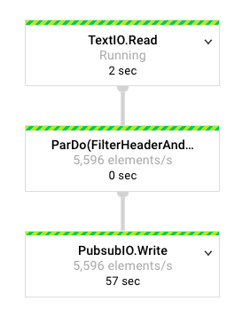
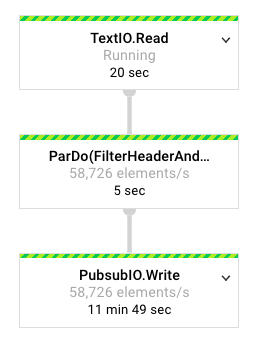
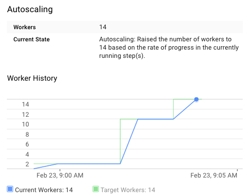
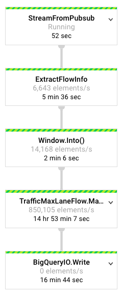

# Overview

This repo contains an example dataflow project that includes a batch pipeline, and a streaming pipeline.

This is an update of https://github.com/james-google/event-streams-dataflow

# Pre-requisites

## Get a Google Cloud Platform Project

To try this, you'll need to have set up a Google Cloud Platform project. You can take advantage of the [GCP free trial](https://console.cloud.google.com/freetrial) if you like.

Enable the APIs required for this tutorial by following the section "Before you begin" at this [quickstart page](https://cloud.google.com/dataflow/docs/quickstarts/quickstart-java-maven).

## Set up a compute instance

We will use this instance to work with the code. Use a Google Compute Engine instance to avoid the inevitable "doesn't work for me" scenario. Feel free to adapt this to your laptop if you like.

Navigate to [Compute](https://console.cloud.google.com/compute) and create a n1-standard-1 instance using the **Ubuntu 16.04 LTS** image in the Cloud Platform UI.

Be sure to allow all API access from the instance:


In the console, launch cloud shell. 


In cloud shell, SSH into your instance as follows, substituting your instance's name as needed:

```
gcloud compute ssh instance-1
```

As of this writing (Feb 2017), the latest gcloud SDK is version 145.0.0. Ubuntu ships with an OS-packaged 140.0.0, so we'll update it. We do this so that we can use the `gcloud alpha` commands for Dataflow and Pub/sub.
Update to the latest gcloud SDK as follows ([reference](https://cloud.google.com/sdk/docs/quickstart-debian-ubuntu)):

```bash
# Create an environment variable for the correct distribution
export CLOUD_SDK_REPO="cloud-sdk-$(lsb_release -c -s)"

# Add the Cloud SDK distribution URI as a package source
echo "deb https://packages.cloud.google.com/apt $CLOUD_SDK_REPO main" | sudo tee -a /etc/apt/sources.list.d/google-cloud-sdk.list

# Import the Google Cloud Platform public key
curl https://packages.cloud.google.com/apt/doc/apt-key.gpg | sudo apt-key add -

# Update the package list and install the Cloud SDK
sudo apt-get update && sudo apt-get install google-cloud-sdk
```

Then install git, openjdk 8 and maven:

```
sudo apt-get update
sudo apt-get install -y git openjdk-8-jdk maven
```

Clone this repository and compile it:

```
git clone https://github.com/vicenteg/dataflow-example.git
cd dataflow-example
mvn clean compile
```

It'll run for a bit and you should see some output at the end like this:

```
[INFO] ------------------------------------------------------------------------
[INFO] BUILD SUCCESS
[INFO] ------------------------------------------------------------------------
[INFO] Total time: 20.610 s
[INFO] Finished at: 2017-02-22T20:54:24+00:00
[INFO] Final Memory: 27M/65M
[INFO] ------------------------------------------------------------------------
```

Try running the starter pipeline as a quick smoke test:

```bash
project=$(gcloud info | egrep ^Project | tr -d '[]' | awk '{ print $2 }')
mvn exec:java -Dexec.mainClass=com.example.dataflow.StarterPipeline -Dexec.args="--project=$project --runner=DataflowRunner"
```

When this completes, you should see something like the following:

```
INFO: To access the Dataflow monitoring console, please navigate to https://console.developers.google.com/project/df-workshop-159603/dataflow/job/2017-02-23_05_08_19-7432109134082082023
Submitted job: 2017-02-23_05_08_19-7432109134082082023
Feb 23, 2017 1:08:20 PM org.apache.beam.runners.dataflow.DataflowRunner run
INFO: To cancel the job using the 'gcloud' tool, run:
> gcloud beta dataflow jobs --project=df-workshop-159603 cancel 2017-02-23_05_08_19-7432109134082082023
[INFO] ------------------------------------------------------------------------
[INFO] BUILD SUCCESS
[INFO] ------------------------------------------------------------------------
[INFO] Total time: 10.552 s
[INFO] Finished at: 2017-02-23T13:08:20+00:00
[INFO] Final Memory: 21M/57M
[INFO] ------------------------------------------------------------------------
```

Note the URL on the first line. Copy and paste that into your browser to see the job status.


Back in the shell on your instance, let's create a Pub/sub topic:

```bash
gcloud alpha pubsub topics create traffic-topic
```

Confirm for yourself that it's there:

```bash
gcloud alpha pubsub topics list
---
topic: projects/df-workshop-159603/topics/traffic-topic
topicId: traffic-topic
```

Note the fully-qualified topic name, which is often required.

Let's start the streaming pipeline (important to run this first, because the next job can consume your CPU quota):

```bash
sh runTrafficMaxLaneFlow.sh
```

This pipeline will read from a Pub/Sub topic, extract the data into a Java object,
create sliding windows, and calculate the maximum lane flow per window.

Locate the monitoring console URL in the output (it will be an INFO level log message).
Open the URL in a new tab. After about 90 seconds, you should see all of the dataflow
steps enter the "Running" state. Though they're running, they won't be doing much since there
are not yet any messages available on the newly-created topic.

So let's, run the injector pipeline to create some messages. This pipeline will inject data
into the pubsub topic for the streaming job to consume.

```bash
sh runInjector.sh
```

Once again, locate the console monitoring URL in the output, and open it in a new tab. 

You can note that this time, the job is a batch, rather than streaming, job. This means that the input is bounded,
which makes sense given that we are targeting a single file.

After about 90 seconds, you should start to see a change - you'll see a number of elements starting to pass through
the pipeline, as evidenced by an **elements/s** metric inside of each step:



After a few minutes, the number will increase pretty dramatically as the job autoscales up to increase throughput:



And in the Summary pane, you'll see the history of the worker count:



Back over in your console monitoring tab for the max lane flow pipeline, you should start to see elements moving through:




If any of the previous jobs are still running, stop them when you're ready to move on to the next section.


# Templates

So far we've launched dataflow jobs from maven. This works in development, but may not be ideal for production.

In production you may not want to compile the job each time, and you may not want to have to have a dependency on maven
to submit the job. This is where [Cloud Dataflow templates](https://cloud.google.com/dataflow/docs/templates/overview) come in.

There's another couple of scripts in this project - `createInjectorTemplate.sh` and `createTrafficMaxLaneFlowTemplate.sh`.

These will, as the names suggest, create templates for the jobs so that we can run them without our development tools.

Execute them in turn and maven will compile the pipelines as before but this time with the addition of the 
`--templateLocation` option, will write the pipeline definition out to GCS so we can launch the already-staged 
pipeline without rebuilding.

```bash
sh createInjectorTemplate.sh
sh createTrafficMaxLaneFlowTemplate.sh
```

Now, you can run each job from the template:

```bash
sh runTrafficMaxLaneFlowTemplate.sh
sh runInjectorTemplate.sh
```

